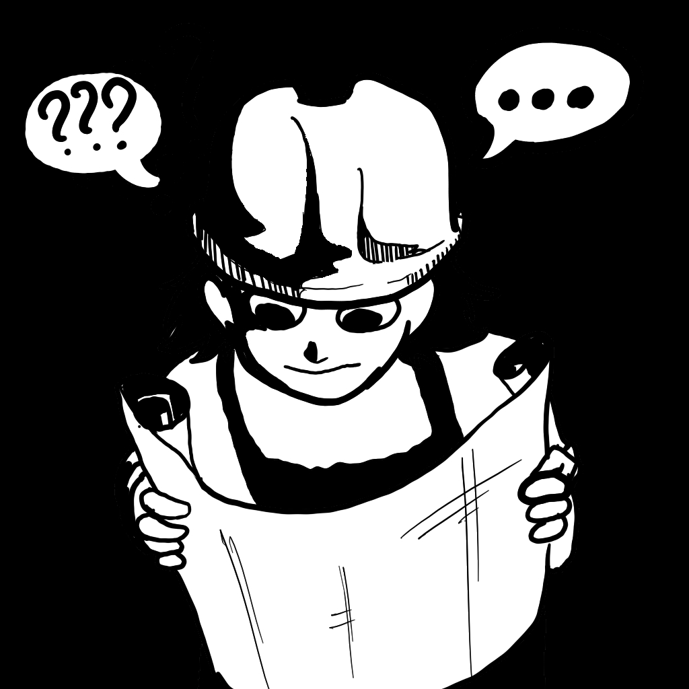

 

## Conceito

Comecei com a pergunta "Como vender meu valor como profissional?". A partir deste ponto comecei a extrair as necessidades de um site deste tipo.

## Conteúdo

Como um portfolio de desenvolvedor, há várias maneiras de expor a *expertise* nessa área. Optei por dois contextos:

**Currículo** e **blog**.

O Currículo é auto-explicativo e é valioso para demonstrar rapidamente minhas habilidades e experiências.

Já o blog oferece uma visão do que estou estudando no momento e do nível e frequência de minhas atividades fora do horário de trabalho. Ele também é um bom diário de bordo.

Ambos apresentam juntos uma boa visão do que esperar de mim como profissional.

## Stack

Comecei com HTML e CSS puros (blasfêmia nos tempos em que vivemos). Após estar satisfeito com o resultado, migrei o projeto para NextJS, por ser muito difundida e oferecer suporte tanto para conteúdo estático, quanto dinâmico.

Para o blog, utilizei a biblioteca react-markdown, para alimentá-la com posts escritos em Markdown para que ela os transforme em páginas prontas para web.

## Estrutura

A estrutura clássica de apps NextJS além da pasta para os blogs em Markdown.
